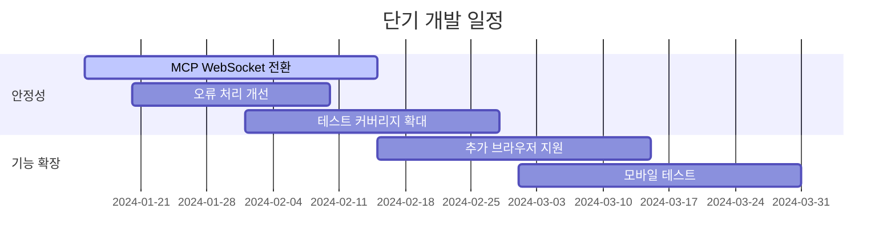

# 🚀 LLM Quality Radar 발전 방향 및 개발 로드맵

## 📊 현재 상태 분석

### ✅ 구현 완료된 기능들
- **Google ADK 기본 통합**: Gemini 2.0 Flash 모델 연동
- **Playwright MCP 클라이언트**: 브라우저 자동화 기반 구축
- **FastAPI 웹 서버**: RESTful API 및 웹 UI 제공
- **자동 복구 시스템**: ML 기반 오류 감지 및 복구 로직
- **품질 모니터링**: 성능, 접근성, 반응형 디자인 검사
- **Cloud 통합**: Google Cloud Services 연동 준비

### ⚠️ 개선이 필요한 영역들
1. **MCP 프로토콜 안정성**: 현재 HTTP 기반, WebSocket으로 전환 필요
2. **AI 모델 최적화**: 더 정확한 테스트 시나리오 생성
3. **확장성**: 대규모 테스트 환경 지원
4. **사용자 경험**: 더 직관적인 인터페이스
5. **보안**: 엔터프라이즈급 보안 기능

## 🎯 단기 개발 목표 (1-3개월)

### 1. 핵심 안정성 강화


#### 우선순위 1: MCP 프로토콜 개선
```python
# 목표: WebSocket 기반 MCP 클라이언트 구현
class EnhancedMCPClient:
    def __init__(self):
        self.websocket_client = None
        self.message_queue = asyncio.Queue()
        self.connection_pool = []
    
    async def connect_websocket(self):
        """WebSocket 기반 안정적인 MCP 연결"""
        uri = "ws://localhost:3001/mcp"
        self.websocket_client = await websockets.connect(uri)
        
    async def send_with_retry(self, message, max_retries=3):
        """재시도 로직이 포함된 메시지 전송"""
        for attempt in range(max_retries):
            try:
                await self.websocket_client.send(json.dumps(message))
                return await self.websocket_client.recv()
            except Exception as e:
                if attempt == max_retries - 1:
                    raise
                await asyncio.sleep(2 ** attempt)
```

#### 우선순위 2: AI 모델 정확도 향상
```python
# 목표: 컨텍스트 인식 능력 강화
class EnhancedAIAgent:
    def __init__(self):
        self.context_memory = []
        self.success_patterns = {}
        self.failure_patterns = {}
    
    async def generate_smart_selectors(self, page_context):
        """페이지 컨텍스트를 이해한 스마트 선택자 생성"""
        prompt = f"""
        페이지 구조: {page_context}
        이전 성공 패턴: {self.success_patterns}
        이전 실패 패턴: {self.failure_patterns}
        
        가장 안정적인 선택자를 생성해주세요.
        """
        
        return await self.llm_agent.run_async(prompt)
```

#### 우선순위 3: 성능 최적화
```python
# 목표: 병렬 처리 및 캐싱 시스템
class PerformanceOptimizer:
    def __init__(self):
        self.browser_pool = BrowserPool(max_size=5)
        self.cache_manager = CacheManager()
        
    async def parallel_test_execution(self, test_suites):
        """병렬 테스트 실행"""
        tasks = []
        for suite in test_suites:
            browser = await self.browser_pool.acquire()
            task = asyncio.create_task(
                self.execute_suite(suite, browser)
            )
            tasks.append(task)
        
        return await asyncio.gather(*tasks)
```

### 2. 사용자 경험 개선

#### 향상된 웹 UI 개발
```typescript
// 목표: React 기반 SPA 구현
interface TestScenarioBuilder {
  // 드래그 앤 드롭 기반 시나리오 구성
  dragDropBuilder: DragDropInterface;
  
  // 실시간 미리보기
  realTimePreview: PreviewPanel;
  
  // 자동 완성 기능
  autoComplete: SmartSuggestions;
}

// 실시간 협업 기능
class CollaborativeEditor {
  async shareSession(sessionId: string) {
    // WebRTC 기반 실시간 편집
  }
  
  async syncChanges(changes: EditorChanges) {
    // 실시간 변경사항 동기화
  }
}
```

#### 모바일 앱 개발
```dart
// 목표: Flutter 기반 모바일 앱
class QualityRadarMobile extends StatefulWidget {
  @override
  Widget build(BuildContext context) {
    return Scaffold(
      appBar: AppBar(title: Text('Quality Radar')),
      body: Column(
        children: [
          TestDashboard(),
          RealTimeMonitoring(),
          QuickTestRunner(),
        ],
      ),
    );
  }
}
```

## 🌟 중기 발전 계획 (3-6개월)

### 1. 엔터프라이즈 기능 추가

#### CI/CD 파이프라인 통합
```yaml
# .github/workflows/quality-radar.yml
name: Quality Radar CI/CD
on:
  push:
    branches: [main, develop]
  pull_request:
    branches: [main]

jobs:
  quality-test:
    runs-on: ubuntu-latest
    steps:
      - uses: actions/checkout@v3
      - name: Setup Quality Radar
        run: |
          python -m pip install -r requirements.txt
          npm install
      
      - name: Run Automated Tests
        run: |
          python -m pytest tests/
          node test-runner.js
      
      - name: Quality Analysis
        run: |
          python quality-analyzer.py --target ${{ github.event.repository.clone_url }}
          
      - name: Generate Report
        uses: actions/upload-artifact@v3
        with:
          name: quality-report
          path: reports/
```

#### 멀티 테넌트 아키텍처
```python
# 목표: 다중 조직 지원
class MultiTenantManager:
    def __init__(self):
        self.tenant_configs = {}
        self.isolation_manager = TenantIsolation()
    
    async def create_tenant(self, tenant_id: str, config: TenantConfig):
        """새 테넌트 생성"""
        await self.isolation_manager.create_namespace(tenant_id)
        await self.setup_tenant_resources(tenant_id, config)
        
    async def get_tenant_context(self, tenant_id: str):
        """테넌트별 컨텍스트 반환"""
        return TenantContext(
            database=f"tenant_{tenant_id}",
            storage_bucket=f"qa-radar-{tenant_id}",
            monitoring_namespace=tenant_id
        )
```

### 2. 고급 AI 기능

#### 자연어 처리 강화
```python
# 목표: 더 정교한 자연어 이해
class AdvancedNLPProcessor:
    def __init__(self):
        self.intent_classifier = IntentClassifier()
        self.entity_extractor = EntityExtractor()
        self.context_analyzer = ContextAnalyzer()
    
    async def parse_test_request(self, natural_language: str):
        """자연어 테스트 요청 분석"""
        intents = await self.intent_classifier.classify(natural_language)
        entities = await self.entity_extractor.extract(natural_language)
        context = await self.context_analyzer.analyze(natural_language)
        
        return TestScenario(
            actions=self._convert_to_actions(intents, entities),
            context=context,
            expected_outcomes=self._extract_expectations(natural_language)
        )
    
    async def generate_test_variations(self, base_scenario: TestScenario):
        """기본 시나리오에서 변형 테스트 생성"""
        variations = []
        
        # 브라우저별 변형
        for browser in ['chrome', 'firefox', 'safari']:
            variations.append(base_scenario.with_browser(browser))
        
        # 디바이스별 변형
        for device in ['desktop', 'tablet', 'mobile']:
            variations.append(base_scenario.with_device(device))
            
        return variations
```

#### 예측 분석 시스템
```python
# 목표: 테스트 결과 예측 및 최적화
class PredictiveAnalytics:
    def __init__(self):
        self.ml_model = QualityPredictionModel()
        self.pattern_detector = PatternDetector()
    
    async def predict_test_outcomes(self, test_plan: TestPlan):
        """테스트 결과 예측"""
        features = self._extract_features(test_plan)
        prediction = await self.ml_model.predict(features)
        
        return TestPrediction(
            success_probability=prediction.success_rate,
            estimated_duration=prediction.duration,
            potential_issues=prediction.risk_factors,
            optimization_suggestions=prediction.improvements
        )
    
    async def optimize_test_order(self, test_suites: List[TestSuite]):
        """테스트 실행 순서 최적화"""
        dependency_graph = self._build_dependency_graph(test_suites)
        optimized_order = await self._optimize_execution_plan(dependency_graph)
        
        return optimized_order
```

## 🌐 장기 비전 (6-12개월)

### 1. 글로벌 플랫폼으로 확장

#### 클라우드 네이티브 아키텍처
```yaml
# kubernetes/quality-radar-deployment.yaml
apiVersion: apps/v1
kind: Deployment
metadata:
  name: quality-radar
spec:
  replicas: 10
  selector:
    matchLabels:
      app: quality-radar
  template:
    metadata:
      labels:
        app: quality-radar
    spec:
      containers:
      - name: api-server
        image: quality-radar/api:latest
        resources:
          requests:
            memory: "512Mi"
            cpu: "250m"
          limits:
            memory: "1Gi"
            cpu: "500m"
---
apiVersion: v1
kind: Service
metadata:
  name: quality-radar-service
spec:
  selector:
    app: quality-radar
  ports:
  - port: 80
    targetPort: 8000
  type: LoadBalancer
```

#### 글로벌 CDN 및 엣지 컴퓨팅
```python
# 목표: 지역별 최적화된 테스트 실행
class GlobalTestOrchestrator:
    def __init__(self):
        self.regions = {
            'us-east-1': 'Virginia',
            'eu-west-1': 'Ireland', 
            'ap-southeast-1': 'Singapore',
            'ap-northeast-2': 'Seoul'
        }
        self.edge_nodes = EdgeNodeManager()
    
    async def select_optimal_region(self, target_url: str):
        """타겟 URL에 최적화된 테스트 지역 선택"""
        latencies = {}
        for region, location in self.regions.items():
            latency = await self._measure_latency(target_url, region)
            latencies[region] = latency
        
        return min(latencies, key=latencies.get)
    
    async def distributed_global_test(self, test_plan: TestPlan):
        """글로벌 분산 테스트 실행"""
        regional_results = {}
        
        for region in self.regions:
            edge_node = await self.edge_nodes.get_node(region)
            result = await edge_node.execute_test(test_plan)
            regional_results[region] = result
        
        return GlobalTestResult(regional_results)
```

### 2. AI 에이전트 생태계

#### 전문화된 AI 에이전트들
```python
# 목표: 도메인별 전문 에이전트
class SpecializedAgentFactory:
    def create_ecommerce_agent(self):
        """전자상거래 전문 테스트 에이전트"""
        return ECommerceTestAgent(
            capabilities=[
                'cart_flow_testing',
                'payment_integration_testing', 
                'inventory_management_testing',
                'recommendation_engine_testing'
            ]
        )
    
    def create_accessibility_agent(self):
        """접근성 전문 테스트 에이전트"""
        return AccessibilityAgent(
            standards=['WCAG_2.1', 'Section_508', 'ADA'],
            tools=['axe_core', 'pa11y', 'lighthouse']
        )
    
    def create_performance_agent(self):
        """성능 전문 테스트 에이전트"""
        return PerformanceAgent(
            metrics=['LCP', 'FID', 'CLS', 'FCP', 'TTI'],
            tools=['lighthouse', 'webpagetest', 'pagespeed_insights']
        )
```

#### 에이전트 간 협업 시스템
```python
# 목표: 에이전트 간 지식 공유 및 협업
class AgentCollaboration:
    def __init__(self):
        self.knowledge_base = SharedKnowledgeBase()
        self.communication_bus = AgentCommunicationBus()
    
    async def coordinate_test_execution(self, agents: List[AIAgent]):
        """에이전트 간 협업 테스트 실행"""
        coordination_plan = await self._create_coordination_plan(agents)
        
        for phase in coordination_plan.phases:
            results = []
            for agent in phase.participating_agents:
                result = await agent.execute_phase(phase)
                results.append(result)
                
                # 다른 에이전트와 결과 공유
                await self.communication_bus.broadcast(
                    message=AgentMessage(
                        sender=agent.id,
                        content=result,
                        recipients=phase.other_agents
                    )
                )
            
            phase.results = results
        
        return coordination_plan
```

## 🔧 기술적 개선 방향

### 1. 성능 최적화

#### 브라우저 인스턴스 풀링
```python
class BrowserPool:
    def __init__(self, max_size=10):
        self.max_size = max_size
        self.available_browsers = asyncio.Queue()
        self.all_browsers = set()
        self.lock = asyncio.Lock()
    
    async def acquire(self) -> PlaywrightBrowser:
        """브라우저 인스턴스 획득"""
        if not self.available_browsers.empty():
            return await self.available_browsers.get()
        
        async with self.lock:
            if len(self.all_browsers) < self.max_size:
                browser = await self._create_browser()
                self.all_browsers.add(browser)
                return browser
        
        # 풀이 가득 찬 경우 대기
        return await self.available_browsers.get()
    
    async def release(self, browser: PlaywrightBrowser):
        """브라우저 인스턴스 반환"""
        await self._cleanup_browser(browser)
        await self.available_browsers.put(browser)
```

#### 지능형 캐싱 시스템
```python
class IntelligentCache:
    def __init__(self):
        self.memory_cache = LRUCache(maxsize=1000)
        self.redis_cache = RedisCache()
        self.cache_analyzer = CacheAnalyzer()
    
    async def get_cached_result(self, test_key: str):
        """캐시된 테스트 결과 조회"""
        # 1. 메모리 캐시 확인
        if test_key in self.memory_cache:
            return self.memory_cache[test_key]
        
        # 2. Redis 캐시 확인
        redis_result = await self.redis_cache.get(test_key)
        if redis_result:
            # 메모리 캐시에도 저장
            self.memory_cache[test_key] = redis_result
            return redis_result
        
        return None
    
    async def should_cache_result(self, test_result: TestResult):
        """결과를 캐시할지 분석"""
        analysis = await self.cache_analyzer.analyze(test_result)
        
        return (
            analysis.execution_time > 10 and  # 실행 시간이 10초 이상
            analysis.success_rate > 0.8 and  # 성공률이 80% 이상
            analysis.stability_score > 0.7   # 안정성 점수가 70% 이상
        )
```

### 2. 보안 강화

#### 인증 및 권한 관리
```python
class SecurityManager:
    def __init__(self):
        self.jwt_manager = JWTManager()
        self.rbac = RoleBasedAccessControl()
        self.audit_logger = AuditLogger()
    
    async def authenticate_user(self, credentials: UserCredentials):
        """사용자 인증"""
        user = await self._validate_credentials(credentials)
        if not user:
            await self.audit_logger.log_failed_auth(credentials.username)
            raise AuthenticationError("Invalid credentials")
        
        token = await self.jwt_manager.create_token(user)
        await self.audit_logger.log_successful_auth(user.id)
        
        return AuthResult(token=token, user=user)
    
    async def authorize_action(self, user: User, action: str, resource: str):
        """작업 권한 확인"""
        permissions = await self.rbac.get_user_permissions(user)
        
        if not self.rbac.can_perform(permissions, action, resource):
            await self.audit_logger.log_unauthorized_access(
                user.id, action, resource
            )
            raise AuthorizationError(f"No permission for {action} on {resource}")
        
        return True
```

#### 데이터 암호화 및 프라이버시
```python
class DataProtection:
    def __init__(self):
        self.encryption_key = self._get_encryption_key()
        self.anonymizer = DataAnonymizer()
        
    async def encrypt_sensitive_data(self, data: dict):
        """민감한 데이터 암호화"""
        sensitive_fields = ['password', 'api_key', 'personal_info']
        
        for field in sensitive_fields:
            if field in data:
                data[field] = await self._encrypt(data[field])
        
        return data
    
    async def anonymize_test_data(self, test_results: TestResults):
        """테스트 데이터 익명화"""
        return await self.anonymizer.anonymize(
            test_results,
            preserve_patterns=True,
            anonymize_urls=True,
            anonymize_personal_data=True
        )
```

## 📈 비즈니스 발전 전략

### 1. 수익화 모델

#### 프리미엄 기능
```python
class PremiumFeatures:
    FEATURES = {
        'free': [
            'basic_web_testing',
            'simple_reports',
            'community_support'
        ],
        'pro': [
            'advanced_ai_analysis',
            'cloud_execution',
            'api_access',
            'priority_support'
        ],
        'enterprise': [
            'unlimited_tests',
            'custom_integrations',
            'dedicated_support',
            'on_premise_deployment',
            'advanced_security',
            'compliance_reports'
        ]
    }
    
    def get_available_features(self, subscription_tier: str):
        return self.FEATURES.get(subscription_tier, [])
```

#### SaaS 플랫폼으로 전환
```python
class SaaSManager:
    def __init__(self):
        self.billing_service = BillingService()
        self.usage_tracker = UsageTracker()
        self.subscription_manager = SubscriptionManager()
    
    async def track_usage(self, user_id: str, action: str):
        """사용량 추적"""
        usage = await self.usage_tracker.record_usage(
            user_id=user_id,
            action=action,
            timestamp=datetime.now()
        )
        
        # 사용량 제한 확인
        limits = await self.subscription_manager.get_user_limits(user_id)
        if usage.exceeds_limits(limits):
            raise UsageLimitExceeded(f"User {user_id} exceeded {action} limit")
        
        return usage
```

### 2. 커뮤니티 및 에코시스템

#### 플러그인 마켓플레이스
```python
class PluginMarketplace:
    def __init__(self):
        self.plugin_registry = PluginRegistry()
        self.security_scanner = PluginSecurityScanner()
        
    async def publish_plugin(self, plugin: Plugin):
        """플러그인 게시"""
        # 보안 검사
        security_result = await self.security_scanner.scan(plugin)
        if not security_result.is_safe:
            raise SecurityViolation(security_result.issues)
        
        # 기능 검증
        validation_result = await self._validate_plugin(plugin)
        if not validation_result.is_valid:
            raise ValidationError(validation_result.errors)
        
        # 마켓플레이스에 등록
        await self.plugin_registry.register(plugin)
        
        return PublishResult(
            plugin_id=plugin.id,
            status='published',
            marketplace_url=f"/marketplace/plugins/{plugin.id}"
        )
```

#### 개발자 API 및 SDK
```python
# Python SDK
class QualityRadarSDK:
    def __init__(self, api_key: str):
        self.client = APIClient(api_key)
        
    async def create_test(self, test_config: TestConfig):
        """프로그래밍 방식으로 테스트 생성"""
        return await self.client.post('/api/v1/tests', test_config.to_dict())
    
    async def run_test(self, test_id: str):
        """테스트 실행"""
        return await self.client.post(f'/api/v1/tests/{test_id}/run')
```

```javascript
// JavaScript SDK
class QualityRadarJS {
    constructor(apiKey) {
        this.apiKey = apiKey;
        this.baseURL = 'https://api.qualityradar.com';
    }
    
    async createTest(testConfig) {
        const response = await fetch(`${this.baseURL}/api/v1/tests`, {
            method: 'POST',
            headers: {
                'Authorization': `Bearer ${this.apiKey}`,
                'Content-Type': 'application/json'
            },
            body: JSON.stringify(testConfig)
        });
        
        return response.json();
    }
}
```

## 🎯 우선순위 및 마일스톤

### Phase 1: 안정성 확보 (1-2개월)
- [ ] MCP WebSocket 프로토콜 전환
- [ ] 오류 처리 및 재시도 로직 강화
- [ ] 종합 테스트 스위트 구축
- [ ] 성능 최적화 (브라우저 풀링, 캐싱)

### Phase 2: 기능 확장 (2-4개월)
- [ ] 추가 브라우저 지원 (Firefox, Safari, Edge)
- [ ] 모바일 테스트 기능
- [ ] 고급 AI 분석 기능
- [ ] CI/CD 파이프라인 통합

### Phase 3: 엔터프라이즈 기능 (4-6개월)
- [ ] 멀티 테넌트 아키텍처
- [ ] 고급 보안 기능
- [ ] 컴플라이언스 리포팅
- [ ] 온프레미스 배포 옵션

### Phase 4: 글로벌 플랫폼 (6-12개월)
- [ ] 클라우드 네이티브 아키텍처
- [ ] 글로벌 CDN 및 엣지 컴퓨팅
- [ ] 플러그인 마켓플레이스
- [ ] 개발자 에코시스템

## 💡 혁신적인 아이디어

### 1. AI 기반 자동 테스트 생성
```python
# 웹사이트를 크롤링하여 자동으로 테스트 시나리오 생성
class AutoTestGenerator:
    async def generate_tests_from_website(self, url: str):
        """웹사이트 분석하여 자동 테스트 생성"""
        site_analysis = await self.analyze_website(url)
        
        test_scenarios = []
        
        # 사용자 플로우 자동 감지
        user_flows = await self.detect_user_flows(site_analysis)
        for flow in user_flows:
            scenarios = await self.generate_flow_tests(flow)
            test_scenarios.extend(scenarios)
        
        # 폼 자동 테스트 생성
        forms = site_analysis.forms
        for form in forms:
            form_tests = await self.generate_form_tests(form)
            test_scenarios.extend(form_tests)
        
        return test_scenarios
```

### 2. 실시간 협업 테스트
```python
# 여러 개발자가 실시간으로 테스트를 공동 작업
class CollaborativeTestSession:
    async def create_shared_session(self, participants: List[User]):
        """공유 테스트 세션 생성"""
        session = SharedSession(
            participants=participants,
            real_time_sync=True,
            voice_chat=True,
            screen_sharing=True
        )
        
        return session
    
    async def sync_test_changes(self, session_id: str, changes: TestChanges):
        """테스트 변경사항 실시간 동기화"""
        await self.broadcast_to_participants(session_id, changes)
```

### 3. 비주얼 회귀 테스트
```python
# AI를 활용한 지능형 비주얼 테스트
class VisualRegressionAI:
    async def intelligent_visual_comparison(self, baseline: Image, current: Image):
        """AI 기반 시각적 비교"""
        differences = await self.ai_model.detect_differences(baseline, current)
        
        # 의미있는 변화와 무의미한 변화 구분
        significant_changes = []
        for diff in differences:
            if await self.is_significant_change(diff):
                significant_changes.append(diff)
        
        return VisualComparisonResult(
            significant_changes=significant_changes,
            confidence_score=0.95
        )
```

이러한 발전 방향을 통해 **LLM Quality Radar**는 단순한 테스트 도구를 넘어서 AI 기반의 종합적인 웹 품질 관리 플랫폼으로 성장할 수 있습니다. 특히 한국의 우수한 개발 환경과 클라우드 인프라를 활용하여 글로벌 시장에서 경쟁력 있는 솔루션으로 발전시킬 수 있을 것입니다.
